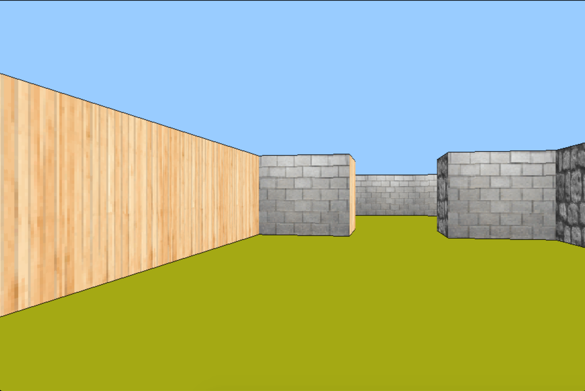

# 🎮 CUB3D

## INFO [🇬🇧]

#### Summary
> This project is  inspired by the world-famous eponymous 90's game, which was the first FPS ever. It will enable you to explore ray-casting. Your goal will be to make a dynamic view inside a maze, in which you'll have to find your way.

### STATUS

| Project status | FINISHED                |
|--------------|---------------------------|
| Proyecto mark |    |

#### CLONE REPO
~~~~~
git clone https://github.com/victorFernandezF/cub3D.git
~~~~~

#### PREVIEW IMAGES

## INFO [:es:]

#### Resumen 
> Este proyecto está inspirado en el juego epónimo mundialmente conocido, considerado como el primer FPS jamás realizado. Le permitirá explorar la técnica del ray-casting. Su objetivo será crear una vista dinámica dentro de un laberinto, en el que tendrá que encontrar la salida.

### ESTADO

| Estado del proyecto | Finalizado         |
|--------------|---------------------------|
| Nota del proyecto   | |

#### CLONAR REPOSITORIO
~~~~~
git clone https://github.com/victorFernandezF/cub3D.git
~~~~~
#### IMAGENES

