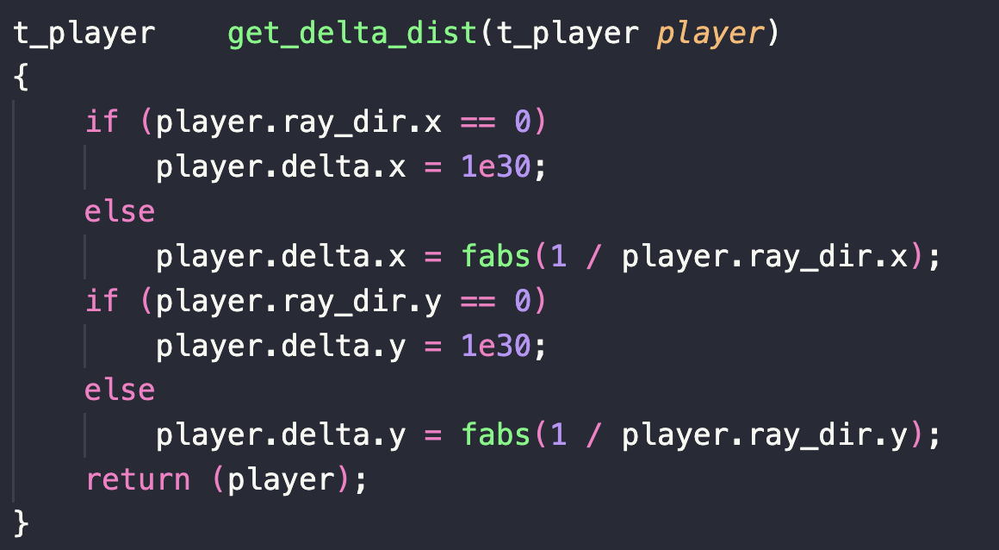

# RAYCASTING

La idea del raycasting es lanzar rayos desde la posicion del jugador (dentro del plano de cámara, que es el campo de visión), esos rayos avanzan por el mapa hasta que chocan con una pared. Cuando esto ocurre, con la distancia recorrida por el rayo podemos calcular el tamaño de la linea vertical que debemos dibujar para conformar la pared.
Vamos a ir dibujando lineas verticales.

Antes de empezar el raycasting, tenemos que definir algunos datos que vamos a necesitar.

<a href="./structs.md"> Ver datos de las estructuras</a>

## datos del jugador (struct player)
Coordenadas del jugador, es la posicion 'x' e 'y' del jugador en el mapa.
Posicion del jugador, las cooredenadas de antes + 0.5;
Le sumamos 0.5 para que el jugador aparezca en el medio de la casilla y no pegado a uno de los bordes borde.
La direccion inicial del jugador, que es un vector e indica hacia donde mira inicialpmente el jugador.

## datos de plano de camara (struct player)
Vamos a necesitar un plano de camara, que va a determinar el campo de visión del jugador.

En la imágen, el punto verde sería el jugador con su vector posicion.
la linea negra seria el vector direccion, y la linea roja, el plano de camara.
el punto gris que está en la línea roja (inicio de la camara), es el resultado de sumar los vectores posicion y direccion.
el punto azul a la izquierda  de la linea roja (final de la camara) se calcula restandole el vector plano a el vector anterios, o lo que es lo mismo posicion + direccion - plano.
Y el punto azul de la derecha es posicion + direccion + plano.

la relacion entre la longitud del plano, y el vector de direccion, nos darán el campo de vision.
* Si el vector plano tiene la misma loongitud que el de rireccion, el campo de vision será de 90 grados
* Si el vectro direccion es mayor que el plano, el campod e vision sera menor de 90 grados.
* Si es menos, el campo será mayor de 90 grados.

## raycasting

### Bucle X
Recorremos el ancho de la ventana con un primer bucle.
Por cada iteración vamos a calcular una serie de datos.
- La posicion X de la camara es la X en el plano que representa las coordenandas de la pantalla. -1 = lado izquierdo de la pantall, 0 = centro y 1 = lado derecho.
cam_x = 2 * [iterador del bucle] / ancho de ventana - 1;

- Posicion del jugador y la direccion de cada rayo.
La posicion del jugador es donde se encuentra en cada momento, es un vector de enteros (x, y).
la direccion del rayo es un vector (x, y) y se calcula así:
direccion rayo x = direccion x del jugador + plano x * camara x.
direccion rayo y = direccion y del jugador + plano y * camara y.
  

- Delta dist es otro vector (x, y) que representa la distancia que debe recorrer el rayo desde un borde de una casilla hasta el siguiente.
Se calcula con una fórmula simplificada del teorema de pitágoras.
 Delta x = |1 / direccion x del rayo|;
 Delta y = |1 / direccion y del rayo|;
en caso de que la direccion del rayo sea 0, evitamos dividir por 0 asignandole un número lo suficientemente alto, como 1e30
  

- Side dist es un vector (x, y)que representa la distancia que debe recorrer el rayo desde que inicia hasta que choca con el primer borde x o y. Tambien definiremos el vector step, que indica la siguiente casilla que debe atravesar el rayo
Su calculo varia segun la direccion del rayo.
	Si la direccion x del rayo es menor que 0
		step_x = -1;
		side_dist_x = (posicion x - (int)posicion x ) * delta_x;
	si no es menor que 0
		step_x = 1;
		side_dist_x = ((int)posicion x  + 1.0 - posicion x) * delta_x;
	y lo mismo para la y.
- hit. esta variable es un entero y nos informará si el rayo ha tocado una pared. Al principio será 0
  

#### raycasting
crearemos un bucle que se ejecutará mientras el rayo no toque la pared (hit  == 0)

vamos a sumar side_dist x y delta_x para obtener la distancua que debe recorrer el rayo.
A la posicion 'x' actual del jugador (casteada a int) le sumaremos el step 'x', para indicar que el rayo avance una casilla del mapa.
is_side nos va a indicar si la pared la vemos de frente o es una lateral.
Side es una variable char para indicarnos que pared es cada una, para poner a cada cual su textura específica.

despues comprobamos si la casilla actual en la que se encuentra el rayo es un 1 en el mapa. Si es así la variable hit pasa a ser 1 y el bucle acaba, si no, continua.
  

### Calcular la linea.
Hemos lanzado un rayo y ha llegado a tocar pared, el bucle anterior ha finalizado, (seguimos dentro del bucle que recorre el ancho de la ventana [bucle x], porque vamos a dibujar una linea vertical. Luego lanzaremos un rayo en la siguiente iteración, hasta llegar al final de la ventana y así ir dibujando el mapa.)

Vamos a calcular la distancia del jugador con la pared.
si la pared no es un lateral, la distancia la calcularemos restando side_dist_x - delta_x.
en caso de ser lateral es la misma operación pero con la y:
side_dist_y - delta_y.
  

Teniendo la distancia, vamos a calcular el punto en el que la línea vertical comienza y el punto en el que finaliza.
  

### Print 3D Map
Ya podemos imprimir cada linea.
- Para hacer el techo (es un color, no una textura).
creamos un bucle que va desde 0 hasta que el inicio de la linea calculada anteriormente. dentro del bucle ponemos cada pixel del color para el techo.

- Para la pared el bucle va desde que la linea empieza hasta que acaba y va a imprimir la textura correspondiente.

- Para el suelo el bucle va desde el final de la linea hasta la altura de la ventana.

## Final del Bucle x